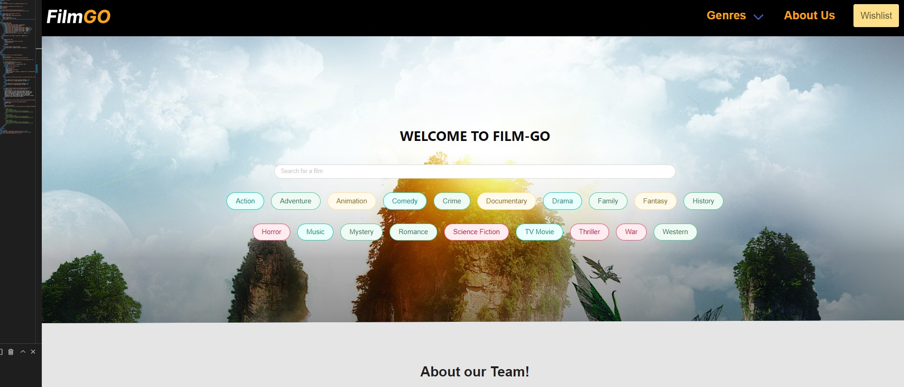
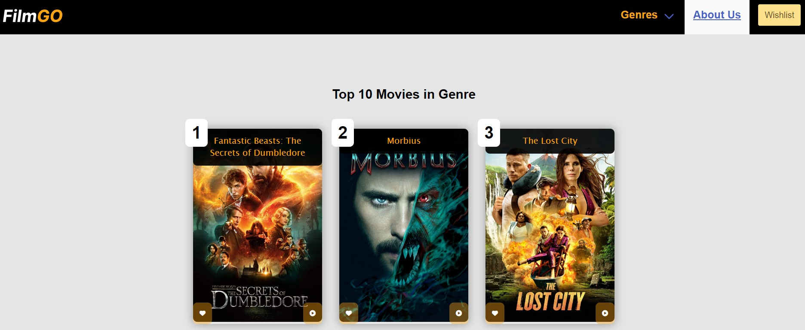

#Film-go Project
1. We have set up the main guidelines for the workflow and how to organise tasks.
2. We Identfied stengths and weaknesses so we could utilise strengths of each team member and try to improve weaknesses through involvement in tasks with others who have strengths in that area.
3. We chose our technologies according to our team capacities and circumstances (e.g using Bulma framework was not ideal but best suitable for our situation having less layers of children classes to target and change unlike Bootstrap which would need a class library to replace some of it's classes, we also could not use UTI materials as it needed SAAS knowledge which we do not have so far).
4. We assigned tasks and discussed them accordingly to make sure we are not causing conflicts.
5. We were commited to learn more of github and utilised it so in future projects we are more comfortable using it.
6. We focused on building functions in a good manner and clean code as much as possible.
7. We made sure we are mimicing real live projects and actually achieving real purposes with our project.
8. We made sure we learnt and absorbed new technologies we were exposed to.
9. Most importantly as future software engineers we improved our abilities on solving problems and achieving progress.
10. [Project link](https://ramielsayed.github.io/film-go/)
11. [repository link](https://github.com/RamiElsayed/film-go.git)
12. 
13. 
